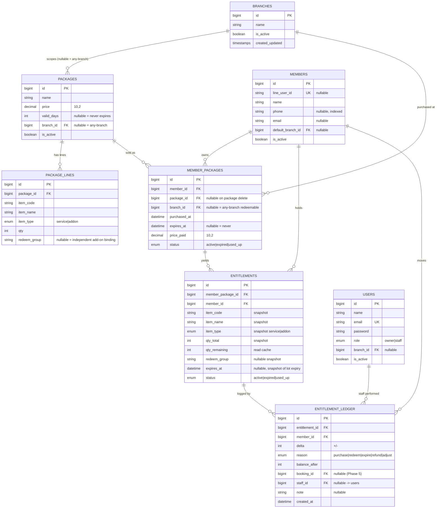

# shop-member — Phase 1 Data Model & Architecture (DESIGN FOR REVIEW)

> **Status:** Design document for human review. **No migrations applied. No code generated.**
> Stack: Laravel 13 (PHP 8.3+) · MySQL · Inertia 3 + Vue 3 on **both** member and admin sides · **NO Filament**.
> Scope: member / entitlement (package-ownership) system, catalog + ledger.
> Sources of truth for conventions: `docs/tech-stack.md` (read 2026-06-29).

> ✅ **Reconciled with tech-stack.md (2026-06-29):** `tech-stack.md §5` now matches this design — **NO Filament — Inertia/Vue on both sides**, admin auth via a plain Laravel guard (`users`) rendered through Inertia.

---

## 1. Overview & Bounded-Context Map

The system tracks **what a member is entitled to** after buying a package, and proves every change to that entitlement via an **append-only ledger**. The hard architectural line is between the **catalog** (what is for sale — mutable, shared) and **what a customer owns** (immutable snapshots + a ledger — the financial record).

### Bounded contexts (modules)

| Context | Tables | Responsibility | Mutability |
|---|---|---|---|
| **Branch** | `branches` | Physical shops; scoping unit for redemption eligibility. | Mutable reference data |
| **Auth (admin)** | `users` | Owner/staff accounts; email+password; performs sales & redemptions. | Mutable |
| **Auth (member)** | `members` | Customers; LINE-login self-register OR admin-created (LINE linkable later). | Mutable |
| **Catalog** | `packages`, `package_lines` | Definitions of sellable packages and their line items (services + add-ons), incl. add-on coupling. **Editing a package never touches sold lots.** | Mutable, versionless |
| **Membership (owned lots)** | `member_packages` | One row per purchase ("lot"). Carries per-lot `expires_at`, price paid, lifecycle status. | Append-on-sale; status transitions only |
| **Entitlement & Ledger** | `entitlements`, `entitlement_ledger` | Per-lot, per-item snapshots of "you have N of item X"; `entitlement_ledger` is the **append-only source of truth** for every +/- movement. `qty_remaining` is a derived cache. | Ledger = append-only; entitlement = cache + status |

### Data-flow summary

```
Catalog (packages/package_lines)
        │  snapshot at purchase (copy item_code/name/type/qty/price)
        ▼
Membership: member_packages (1 lot)  ──►  entitlements (1 per package_line)
                                                  │
                                                  ▼
                                    entitlement_ledger (append-only +/- rows)
                                                  │  balance_after recomputes
                                                  ▼
                                    entitlements.qty_remaining (read cache)
```

Golden rule: **catalog feeds membership by VALUE COPY (snapshot), never by live reference.** A price change or renamed line in `packages`/`package_lines` must not retroactively alter a sold lot.

---

## 2. ERD (Mermaid `erDiagram`)



> Cardinality recap: a member has many lots; a lot yields many entitlements (one per package line); each entitlement has many ledger rows. The ledger is the leaf and the truth.

---

## 3. Table-by-Table Spec

Conventions: all PKs are `bigint unsigned auto_increment`. All tables carry `created_at`/`updated_at` (`timestamps`) **except `entitlement_ledger`**, which is append-only and keeps only `created_at` (`useCurrent`, no `updated_at` — rows are never updated). FK on-delete behavior is stated per relationship. "Snapshot" = value copied at purchase time, never re-read from catalog.

### 3.1 `branches`

| Column | Type | Null | Default | Notes |
|---|---|---|---|---|
| id | bigint unsigned | no | auto | PK |
| name | varchar(120) | no | — | Shop display name |
| is_active | boolean | no | true | Soft on/off without delete |
| created_at / updated_at | timestamp | yes | null | |

- **PK:** `id`
- **Unique:** `name` (decided: yes — prevents duplicate branch names)
- **Indexes:** `is_active` (filter active branches in pickers)

### 3.2 `users` (admin guard)

| Column | Type | Null | Default | Notes |
|---|---|---|---|---|
| id | bigint unsigned | no | auto | PK |
| name | varchar(120) | no | — | |
| email | varchar(190) | no | — | Login id |
| email_verified_at | timestamp | yes | null | Standard Laravel |
| password | varchar(255) | no | — | bcrypt/argon hash |
| role | enum('owner','staff') | no | 'staff' | Authorization role |
| branch_id | bigint unsigned | yes | null | Home branch of staff; null = unscoped/owner |
| is_active | boolean | no | true | Disable login without delete |
| remember_token | varchar(100) | yes | null | Standard Laravel |
| created_at / updated_at | timestamp | yes | null | |

- **PK:** `id`
- **FK:** `branch_id → branches.id` **ON DELETE SET NULL** (deleting a branch must not delete staff)
- **Unique:** `email`
- **Indexes:** `(role)`, `(branch_id)`
- **Guard:** `auth.guards.users` (web session). Used as `staff_id` in the ledger.

### 3.3 `members` (member guard)

Supports **both** LINE self-register and admin-created accounts. `line_user_id` is **nullable** so an admin can create a member first and link LINE later.

| Column | Type | Null | Default | Notes |
|---|---|---|---|---|
| id | bigint unsigned | no | auto | PK |
| line_user_id | varchar(64) | yes | null | LINE `sub`/userId. **Nullable + UNIQUE** (link later). Null for admin-created-not-yet-linked |
| name | varchar(120) | no | — | Display name (from LINE or admin entry) |
| phone | varchar(20) | yes | null | THb mobile; primary lookup at counter |
| email | varchar(190) | yes | null | Optional |
| avatar_url | varchar(512) | yes | null | LINE picture, optional |
| default_branch_id | bigint unsigned | yes | null | Home branch hint (not an enforcement) |
| password | varchar(255) | yes | null | Nullable — LINE members have no password; admin-created counter accounts may |
| is_active | boolean | no | true | |
| remember_token | varchar(100) | yes | null | |
| deleted_at | timestamp | yes | null | **Soft delete** — members are never hard-deleted (protects the financial ledger; see §5.4) |
| created_at / updated_at | timestamp | yes | null | |

- **PK:** `id`
- **FK:** `default_branch_id → branches.id` **ON DELETE SET NULL**
- **Unique:** `line_user_id` (partial-by-nature: MySQL allows multiple NULLs in a UNIQUE index, so many unlinked members coexist; once set, a LINE id maps to exactly one member)
- **Indexes:** `(phone)` (counter lookup), `(default_branch_id)`
- **Guard:** `auth.guards.members` (separate session guard / provider). Distinct from `users`.
- **Soft delete:** `deleted_at` (Laravel `SoftDeletes`). Members are **never hard-deleted** — all child FKs (`member_packages`, `entitlements`, `entitlement_ledger`) use **ON DELETE RESTRICT** so an accidental `DELETE` can't wipe the financial/audit ledger (see §5.4). Disable via `is_active=false`.

### 3.4 `packages` (catalog)

| Column | Type | Null | Default | Notes |
|---|---|---|---|---|
| id | bigint unsigned | no | auto | PK |
| name | varchar(150) | no | — | |
| price | decimal(10,2) | no | — | THB. **NEVER float.** List price |
| valid_days | int unsigned | yes | null | **Null = never expires** → sold lot gets `expires_at = null` |
| branch_id | bigint unsigned | yes | null | **Null = redeemable at ANY branch.** Set = that branch only |
| is_active | boolean | no | true | Hide from sale without delete |
| created_at / updated_at | timestamp | yes | null | |

- **PK:** `id`
- **FK:** `branch_id → branches.id` **ON DELETE RESTRICT** (a branch with packages bound to it should not be silently deletable — force the admin to reassign/deactivate first; alternatively SET NULL if "make any-branch on delete" is acceptable — **RESTRICT chosen** to avoid accidental scope-widening)
- **Indexes:** `(is_active)`, `(branch_id)`

### 3.5 `package_lines` (catalog detail + add-on binding)

| Column | Type | Null | Default | Notes |
|---|---|---|---|---|
| id | bigint unsigned | no | auto | PK |
| package_id | bigint unsigned | no | — | Owner package |
| item_code | varchar(40) | no | — | Stable business code (e.g. `MASSAGE_60`, `HOT_STONE`) |
| item_name | varchar(150) | no | — | Human label |
| item_type | enum('service','addon') | no | 'service' | service = main redeemable; addon = extra |
| qty | int unsigned | no | — | Units granted per purchase of this line |
| redeem_group | varchar(40) | yes | null | **Add-on coupling.** See §5.3. Null = independent line |
| created_at / updated_at | timestamp | yes | null | |

- **PK:** `id`
- **FK:** `package_id → packages.id` **ON DELETE CASCADE** (lines belong wholly to the package definition; deleting a draft package removes its lines. Note: sold lots already snapshotted, so cascade is safe for owned data)
- **Unique:** `(package_id, item_code)` — one logical item per package; prevents duplicate lines
- **Indexes:** `(package_id)`, `(package_id, redeem_group)` (resolve a redeem group within a package)

### 3.6 `member_packages` (owned lot)

One row per purchase. The unit of per-lot expiry and the parent of its entitlements.

| Column | Type | Null | Default | Notes |
|---|---|---|---|---|
| id | bigint unsigned | no | auto | PK |
| member_id | bigint unsigned | no | — | Owner |
| package_id | bigint unsigned | yes | null | Source package (FK SET NULL on delete — keep the lot even if catalog row removed) |
| branch_id | bigint unsigned | yes | null | **Snapshot of redemption scope.** Null = any-branch (from `packages.branch_id` null at sale time) |
| purchased_at | datetime | no | — | Sale timestamp |
| expires_at | datetime | yes | null | **Per-lot.** `purchased_at + valid_days`; **null = never** |
| price_paid | decimal(10,2) | no | — | THB actually paid (may differ from list `price`) |
| status | enum('active','expired','used_up') | no | 'active' | Lifecycle, see §5.6 |
| created_at / updated_at | timestamp | yes | null | |

- **PK:** `id`
- **FK:** `member_id → members.id` **ON DELETE RESTRICT** (protect the financial record — members are soft-deleted/deactivated, never hard-deleted; see §5.4)
- **FK:** `package_id → packages.id` **ON DELETE SET NULL** (financial record survives catalog cleanup)
- **FK:** `branch_id → branches.id` **ON DELETE SET NULL** (lot becomes any-branch if its branch is removed — acceptable, and snapshotted so redemption still works)
- **Indexes:** `(member_id, status)`, `(status, expires_at)` (expiry job scan), `(branch_id)`

> **branch_id is snapshotted here** intentionally: copying `packages.branch_id` into the lot at sale freezes the cross-branch rule for that purchase even if the catalog package is later re-scoped.

### 3.7 `entitlements` (owned, per-item — SNAPSHOT + read cache)

One row per `package_line` of the purchased package. All item descriptor fields are **snapshotted** from the catalog at purchase; `qty_remaining` is a **derived cache** reconcilable from the ledger.

| Column | Type | Null | Default | Notes |
|---|---|---|---|---|
| id | bigint unsigned | no | auto | PK |
| member_package_id | bigint unsigned | no | — | Parent lot |
| member_id | bigint unsigned | no | — | **Denormalized** owner (so redemption query needs no join to lot) |
| item_code | varchar(40) | no | — | **SNAPSHOT** of `package_lines.item_code` |
| item_name | varchar(150) | no | — | **SNAPSHOT** |
| item_type | enum('service','addon') | no | — | **SNAPSHOT** |
| qty_total | int unsigned | no | — | **SNAPSHOT** of granted qty (= ledger purchase delta) |
| qty_remaining | int unsigned | no | — | **READ CACHE.** = qty_total + Σ(ledger.delta). Reconcilable |
| redeem_group | varchar(40) | yes | null | **SNAPSHOT** of `package_lines.redeem_group` (add-on coupling, frozen) |
| expires_at | datetime | yes | null | **SNAPSHOT** of lot `expires_at` (denormalized for FIFO/index; null = never) |
| status | enum('active','expired','used_up') | no | 'active' | Lifecycle, see §5.6 |
| created_at / updated_at | timestamp | yes | null | |

- **PK:** `id`
- **FK:** `member_package_id → member_packages.id` **ON DELETE CASCADE**
- **FK:** `member_id → members.id` **ON DELETE RESTRICT** (protect ledger; member soft-delete only — §5.4)
- **Indexes:** see §4 — the FIFO redemption composite and the aggregate index both live here.
- **CHECK:** `qty_remaining >= 0`, `qty_total >= 0` (MariaDB 11.4 enforces CHECK) — a double-spend/bad-`adjust` bug surfaces as an error instead of silently wrapping the `unsigned` column.

> **Why `member_id` and `expires_at` are denormalized onto `entitlements`:** the hot redemption query (§4.1) filters by `member_id` + `item_code` + `status` + `qty_remaining` + `expires_at` and orders by `expires_at`. Keeping all of these on one table lets a single composite index serve the whole query with no join. Both are snapshots and never drift (lot expiry is fixed at sale).

### 3.8 `entitlement_ledger` (APPEND-ONLY — source of truth)

Every entitlement movement is one immutable row. `qty_remaining` on `entitlements` must always equal `qty_total + Σ delta` for active history.

| Column | Type | Null | Default | Notes |
|---|---|---|---|---|
| id | bigint unsigned | no | auto | PK |
| entitlement_id | bigint unsigned | no | — | Which entitlement moved |
| member_id | bigint unsigned | no | — | Denormalized owner (member-level statements without join) |
| delta | int (signed) | no | — | `+qty` on purchase/refund; `-qty` on redeem/expire |
| reason | enum('purchase','redeem','expire','refund','adjust') | no | — | Movement classification |
| balance_after | int unsigned | no | — | `qty_remaining` AFTER this row applied. Lets reconcile verify monotonic chain |
| booking_id | bigint unsigned | yes | null | **Forward-ref Phase 5** — set on redeem when bookings exist. FK deferred |
| staff_id | bigint unsigned | yes | null | `users.id` who performed it; null for system jobs (expiry) |
| note | varchar(255) | yes | null | Free text (e.g. adjust reason) |
| created_at | timestamp | no | useCurrent | **No `updated_at`** — rows never change |

- **PK:** `id`
- **FK:** `entitlement_id → entitlements.id` **ON DELETE CASCADE** (ledger lives and dies with its entitlement; in practice neither is deleted)
- **FK:** `member_id → members.id` **ON DELETE RESTRICT** (the ledger is the audit truth — never cascade-deleted via a member; §5.4)
- **FK:** `staff_id → users.id` **ON DELETE SET NULL** (keep ledger even if a staff account is removed)
- **FK (deferred):** `booking_id → bookings.id` — **NOT created in Phase 1** (no `bookings` table yet). Column exists now; the FK constraint is added in the Phase-5 migration that creates `bookings`. Documented so the column isn't repurposed.
- **Indexes:** `(entitlement_id, id)` (replay a single entitlement's history in order — `id` is the tiebreaker since `created_at` can collide), `(member_id, created_at)` (member statement / activity feed), `(reason, created_at)` (audit / reporting by movement type)
- **CHECK:** `balance_after >= 0`. No code path writes `booking_id` before Phase 5 (FK added then).

---

## 4. Index List (each tied to its query)

| # | Table | Index (columns) | Serves |
|---|---|---|---|
| **I1 (critical)** | `entitlements` | `(member_id, item_code, status, expires_at, qty_remaining)` | **FIFO redemption (Phase 5).** Query: `WHERE member_id=? AND item_code=? AND status='active' AND qty_remaining>0 AND expires_at > NOW() ORDER BY expires_at ASC` (NULLs-never-expire handled in WHERE/order — see note). Leading equality cols `member_id,item_code,status` serve the lookup. **NOTE:** the FIFO `ORDER BY expires_at IS NULL ASC, expires_at ASC` is an expression, so MySQL/MariaDB **filesorts** the tiny (~1–20 row) per-member+item set — the index accelerates the lookup, **not** the sort (negligible at this scale). `lockForUpdate()` locks that small set. |
| **I2 (aggregate)** | `entitlements` | `(member_id, item_type, status, expires_at)` | **"Remaining by type"** e.g. `SELECT SUM(qty_remaining) WHERE member_id=? AND item_type='service' AND status='active' AND (expires_at IS NULL OR expires_at > NOW())`. Equality on `member_id,item_type,status` then `expires_at` range. |
| I3 | `entitlements` | `(status, expires_at)` | **Expiry job daily scan:** find `status='active' AND expires_at IS NOT NULL AND expires_at <= NOW()` to flip → expired. |
| I4 | `entitlements` | `(member_package_id)` | Load all entitlements of a lot (lot detail screen, snapshot creation). |
| I5 | `entitlement_ledger` | `(entitlement_id, id)` | **Reconcile** & single-entitlement history replay in insertion order. |
| I6 | `entitlement_ledger` | `(member_id, created_at)` | Member transaction statement / activity feed. |
| I7 | `entitlement_ledger` | `(reason, created_at)` | Audit reports by movement type (e.g. all expirations in a period). |
| I8 | `member_packages` | `(member_id, status)` | Member's active lots list. |
| I9 | `member_packages` | `(status, expires_at)` | Lot-level expiry scan (flip lot → expired/used_up). |
| I10 | `package_lines` | `(package_id, item_code)` UNIQUE | Catalog integrity + group resolution. |
| I11 | `members` | `(phone)` | Counter lookup by phone. |
| I12 | `members` | `(line_user_id)` UNIQUE | LINE login resolution + link-later guard. |
| I13 | `users` | `(email)` UNIQUE | Admin login. |

> **NULL-expiry handling for I1/I2:** lots with `valid_days = null` have `expires_at = null` (never expire). The redemption/aggregate `WHERE` must read `(expires_at IS NULL OR expires_at > NOW())`. For the FIFO `ORDER BY expires_at ASC`, MySQL sorts NULLs first; that is **wrong** for FIFO (a never-expiring lot should be consumed *last*, after dated lots). **Fix:** order by `expires_at IS NULL ASC, expires_at ASC` (dated-soonest first, never-expiring last). This is a query-shape rule, noted here so Phase 5 implements it; I1 still accelerates the equality + range portion.

---

## 5. Design Rationale

### 5.1 Catalog vs. owned split
`packages`/`package_lines` are **mutable marketing/config data**; `member_packages`/`entitlements` are **financial records**. If owned rows referenced the catalog by FK only, editing a package price or renaming a line would silently rewrite history and break refunds/audits. We therefore **snapshot** (`item_code`, `item_name`, `item_type`, `qty_total`, `redeem_group`, `expires_at`, `price_paid`) into the owned rows at purchase. Catalog can evolve freely; sold lots are frozen. `member_packages.package_id` is kept (nullable, SET NULL) only as a *provenance hint*, not a data source.

### 5.2 Ledger as truth + `qty_remaining` cache
`entitlement_ledger` is **append-only**: purchase (+), redeem (−), expire (−), refund (+), adjust (±). The true balance is `qty_total + Σ delta`. Reading that sum on every redemption check would be slow and lock-heavy, so `entitlements.qty_remaining` caches it and `balance_after` snapshots the running total per row. Invariant: **`qty_remaining == latest ledger.balance_after` for the entitlement** (and `== qty_total + Σ delta`). The reconcile command (§6.1) can rebuild the cache from the ledger at any time — the cache is disposable, the ledger is not. `entitlement_ledger` deliberately has **no `updated_at`** to make immutability structural.

### 5.3 Add-on coupling mechanism — `redeem_group` (chosen)
The spec offers two options: a `bound_to_item_code` pointer or a `redeem_group` string. **We choose `redeem_group` (nullable varchar)** on `package_lines`, snapshotted onto `entitlements`.

- **Independent add-on:** `redeem_group = NULL`. Redeems entirely on its own.
- **Bound add-on(s) + service:** the service line and the add-on line(s) that must redeem together share the **same non-null `redeem_group`** value (e.g. `GRP_HOTSTONE`). At redemption, the engine decrements **every active entitlement in the same lot sharing that group** atomically.

**Why `redeem_group` over `bound_to_item_code`:**
1. **N-way coupling for free** — one service can bind multiple add-ons (and add-ons to add-ons) by sharing a label; a pointer column models only a single parent edge cleanly.
2. **No direction/dangling problem** — a pointer to a removed/renamed `item_code` becomes a dangling reference; a shared label has no referential edge to break, and it survives the snapshot cleanly (it's just a copied string scoped within a single lot).
3. **Single schema for both modes** — null vs. non-null on one column expresses "independent" vs. "bound" with no extra table.
4. **Lot-scoped** — grouping is resolved *within one `member_package`*, so two lots reusing the same group label never commingle (matches the "add-ons per lot don't commingle" rule).

Index `(package_id, redeem_group)` and the lot-scoped query on `entitlements (member_package_id, redeem_group)` resolve a group efficiently. (A future hard-FK variant could add a `redeem_groups` table if labels need governance, but Phase 1 keeps it a string.)

### 5.4 Two-guard tables (`users` vs `members`)
Admin and customer are different identity domains with different login methods (email+password vs LINE), different lifecycles, and different authorization. Two tables + two Laravel guards (`users`, `members`) keep them isolated: no nullable-password hacks on a shared table, no risk of a customer record satisfying an admin policy, and clean `staff_id → users` references in the ledger. Members allow a **nullable password** (LINE members have none) and a **nullable, unique `line_user_id`** (admin-created accounts link LINE later — MySQL/MariaDB permits multiple NULLs under a UNIQUE index, so many unlinked members coexist; this relies on MySQL/MariaDB NULL semantics — note it if ever porting engines).

**Member deletion is forbidden at the DB level.** `members` uses `SoftDeletes` (`deleted_at`); every child FK from a member (`member_packages`, `entitlements`, `entitlement_ledger`) is **ON DELETE RESTRICT**. The ledger is the append-only financial/audit truth (§5.2) — a stray `DELETE FROM members` must never cascade it away. Operationally use `is_active=false`; if a compliance hard-erase is ever required, it must be an explicit, logged procedure that archives the ledger first, never a cascade.

### 5.5 Cross-branch rule
Rule: `branch_id IS NULL` → redeemable at **any** branch; `branch_id` set → redeemable **only** at that branch. We snapshot the scope from `packages.branch_id` into `member_packages.branch_id` at sale, so re-scoping the catalog later doesn't change an existing lot. `entitlements` inherit eligibility via their parent lot; the redemption filter adds `(mp.branch_id IS NULL OR mp.branch_id = :current_branch)`. (If a future need arises to filter eligibility purely on `entitlements` without the lot join, `branch_id` can also be denormalized down — deferred; current join is cheap via I4/I8.)

### 5.6 Money type
All monetary columns are `decimal(10,2)` (THB), **never float/double**, to avoid binary rounding error in sums and refunds. `10,2` covers up to 99,999,999.99 THB — ample for package prices. Application layer should use integer-minor-unit or `brick/money`/`bcmath` for arithmetic; the DB stores exact decimal.

### 5.7 Status lifecycles

**`member_packages.status`** and **`entitlements.status`** share the same vocabulary:

```
active ──(all qty consumed)──► used_up
   │
   └────(expires_at <= now)──► expired
```
- `active`: redeemable.
- `used_up`: `qty_remaining` hit 0 via redemption. Terminal.
- `expired`: passed `expires_at` while still having qty. Terminal. Daily job writes a ledger row `reason=expire, delta=-qty_remaining` then sets `qty_remaining=0`.
- A lot's status is a rollup: `used_up` when all its entitlements are `used_up`; `expired` when the lot's `expires_at` passes. Both are terminal — no resurrection (a refund creates a **new** positive ledger row on a still-active entitlement; it does not un-terminate a closed one).

---

## 6. Integrity & Ops Notes

### 6.1 Reconcile command (`php artisan entitlements:reconcile`)
Rebuilds `entitlements.qty_remaining` from `entitlement_ledger` and verifies the `balance_after` chain.
- For each entitlement: `expected = qty_total + SUM(delta)`; compare to `qty_remaining`. Walk rows ordered by I5 `(entitlement_id, id)` and assert each `balance_after` equals the running sum (detects tampering/gaps).
- Report mismatches; `--fix` rewrites the cache from the ledger. **Ledger is authoritative; cache yields.**
- Run in chunks (`chunkById`) to avoid loading all rows.

### 6.2 Expiry job (daily, scheduled)
1. Lot pass: `member_packages WHERE status='active' AND expires_at IS NOT NULL AND expires_at <= now()` → set `status='expired'` (uses I9).
2. Entitlement pass: `entitlements WHERE status='active' AND expires_at IS NOT NULL AND expires_at <= now() AND qty_remaining > 0` (uses I3). For each, **inside a transaction**: insert ledger row `reason='expire', delta = -qty_remaining, balance_after = 0, staff_id = NULL`, then set `qty_remaining = 0, status='expired'`.
3. Promote lots whose entitlements are all closed to `used_up`/`expired` accordingly.
- The ledger row makes expiry **auditable and reconcilable** — a flipped status with no ledger entry would break the §6.1 invariant.

### 6.3 Redemption locking / transaction (forward-ref Phase 5)
Per redeem of `item_code` × `qty` at `:branch`:
```
DB::transaction(function () {
    $rows = Entitlement::query()
        ->where('member_id', $memberId)
        ->where('item_code', $itemCode)
        ->where('status', 'active')
        ->where('qty_remaining', '>', 0)
        ->where(fn($q) => $q->whereNull('expires_at')->orWhere('expires_at', '>', now()))
        ->whereHas('memberPackage', fn($q) =>
            $q->whereNull('branch_id')->orWhere('branch_id', $branchId))
        ->orderByRaw('expires_at IS NULL asc, expires_at asc')   // FIFO, never-expiring last
        ->lockForUpdate()                                        // rides I1
        ->get();
    // walk rows, decrement, insert ledger row per touched entitlement,
    // set balance_after, flip used_up when reaching 0,
    // and decrement bound redeem_group siblings in the same lot atomically.
});
```
- `lockForUpdate()` inside a transaction serializes concurrent redemptions of the same entitlements (prevents double-spend). Index I1 keeps the locked row-set tight.
- Each decrement writes **one ledger row** (`reason='redeem'`, `staff_id`, later `booking_id`) and updates `balance_after` + `qty_remaining` together.
- **Bound add-ons:** after selecting the service rows, also select & decrement entitlements in the **same `member_package_id`** sharing the service's `redeem_group`, in the same transaction.

### 6.4 N+1 risk flags & required eager-loads (Laravel convention)
| Screen / job | Risk | Eager-load |
|---|---|---|
| Member dashboard (lots + their items) | lazy-load entitlements per lot | `Member::with(['memberPackages.entitlements'])` |
| Lot detail + ledger | lazy-load ledger per entitlement | `MemberPackage::with(['entitlements.ledgerEntries'])` |
| Ledger/statement feed (who did it) | lazy-load staff per row | `EntitlementLedger::with('staff')` (and `entitlement:id,item_name` for label) |
| Catalog editor (packages + lines) | lazy-load lines per package | `Package::with('lines')` |
| Admin members list with branch | lazy-load branch per member | `Member::with('defaultBranch')` |
| Redemption (already loaded set) | — | use the already-fetched `$rows`; `load('memberPackage:id,branch_id')` if not selected |
| Aggregate "remaining by type" | N queries per type | single grouped query (`selectRaw('item_type, SUM(qty_remaining)')->groupBy('item_type')`), not per-row hydration |

Always select explicit columns on ledger-heavy loads to keep payloads small; prefer `withSum`/`withCount` for dashboard tallies over hydrating collections.

---

## 7. Migration Plan (ordered, dependency-first — filenames + purpose only)

> No bodies here. Order respects FK dependencies. Laravel default `users` migration is replaced/extended to add `role`, `branch_id`, `is_active`.

| Order | Filename | Purpose |
|---|---|---|
| 0001 | `0001_01_01_000000_create_branches_table.php` | Branches (scoping unit) — no FKs. |
| 0002 | `0001_01_01_000100_create_users_table.php` | Admin guard: add `role`, `branch_id` FK (SET NULL), `is_active`. |
| 0003 | `0001_01_01_000200_create_members_table.php` | Member guard: nullable+unique `line_user_id`, phone, nullable password, `default_branch_id` FK. |
| 0004 | `0001_01_01_000300_create_packages_table.php` | Catalog: price decimal(10,2), nullable `valid_days`, nullable `branch_id` FK (RESTRICT). |
| 0005 | `0001_01_01_000400_create_package_lines_table.php` | Catalog detail: item fields, `item_type` enum, `qty`, nullable `redeem_group`; unique (package_id,item_code). |
| 0006 | `0001_01_01_000500_create_member_packages_table.php` | Owned lots: per-lot `expires_at`, snapshot `branch_id`, `price_paid`, status enum; FKs to members/packages/branches. |
| 0007 | `0001_01_01_000600_create_entitlements_table.php` | Owned per-item snapshots + `qty_remaining` cache; FIFO index I1, aggregate index I2, scan index I3. |
| 0008 | `0001_01_01_000700_create_entitlement_ledger_table.php` | Append-only ledger: delta, reason enum, balance_after, nullable staff_id FK (SET NULL) and **nullable `booking_id` column with NO FK yet**; indexes I5–I7. |
| 0009 | `0001_01_01_000800_add_jobs_and_cache_tables.php` | (Optional, Laravel defaults) queue `jobs`/`failed_jobs` + cache table for the scheduled expiry/reconcile jobs. |
| — | _(Phase 5)_ `..._create_bookings_table.php` | Creates `bookings`; **then** adds the deferred FK `entitlement_ledger.booking_id → bookings.id`. Not in Phase 1. |

---

⚠️ This is a design for review — no migrations applied yet.
