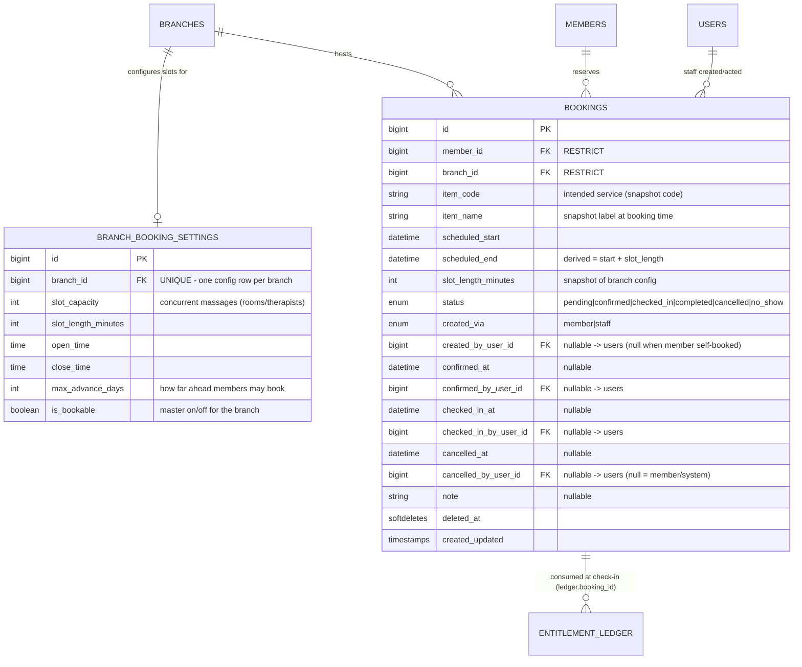

# shop-member — Phase 7 Booking (จองคิว) Data Model & Architecture (DESIGN FOR REVIEW)

> **Status:** Design document for human + client review. **No migrations applied. No models/services written.**
> Stack: Laravel 13 (PHP 8.3+) · **MariaDB** · Inertia 3 + Vue 3 on both member and admin sides · NO Filament.
> Scope: Phase 7 — time-slot booking with per-slot capacity; redemption is deducted at CHECK-IN, not at booking.
> Extends `docs/architecture.md` (Phase 1). Matches its table/column/index/enum/CHECK conventions exactly.

> **Naming note:** Phase-1 docs/comments call bookings "Phase 5" as a forward-reference placeholder. The booking work is delivered as **Phase 7** per the current spec. The reserved `entitlement_ledger.booking_id` column those comments describe is the same column this design activates — see §7. (No renaming of existing comments is required; this doc supersedes the "Phase 5" label for bookings.)

---

## 1. Overview & where Phase 7 sits

Phase 7 lets a member reserve a time to come in. A booking is an **intention to be served** — it names a branch, a date/time-slot, and which service (`item_code`) the member plans to redeem. It is deliberately **decoupled from the entitlement balance**:

- **Booking does NOT reserve or hold an entitlement.** No ledger row is written when a booking is made.
- **A member may book without owning the package yet** — they can buy at the counter on arrival. Balance is only checked at redemption time.
- **Redemption happens at CHECK-IN**, through the *existing* `RedemptionService.redeem()`. The check-in stamps the resulting ledger rows with `booking_id`, so a completed booking links to exactly what it consumed.

The only structural coupling to the financial core is the already-reserved `entitlement_ledger.booking_id` column (Phase 1, nullable, no FK yet). Phase 7 adds the `bookings` table and the deferred FK. The append-only ledger remains the source of truth; bookings are **scheduling/operational data**, not financial data.

### Bounded context addition

| Context | Tables | Responsibility | Mutability |
|---|---|---|---|
| **Booking (scheduling)** | `bookings`, `branch_booking_settings` | Reservations of a branch time-slot for an intended service; per-branch slot config & capacity. Consumes nothing until check-in. | Mutable (status transitions); soft-deleted |

---

## 2. ERD (Mermaid `erDiagram`) — additions only



> The `bookings → entitlement_ledger` edge is **soft** (via `ledger.booking_id`), created at check-in — a booking has zero, one, or several ledger rows (a service + its coupled `redeem_group` add-ons all stamped with the same `booking_id`). A `pending`/`cancelled`/`no_show` booking has none.

---

## 3. Table-by-Table Spec

Conventions carried over from `architecture.md`: PKs are `bigint unsigned auto_increment`; all tables carry `timestamps()`; native `enum()` columns (matching `member_packages.status`, `entitlement_ledger.reason`); FKs via `foreignId()->constrained()->{null,restrict,cascade}OnDelete()`; named indexes `idx_<table>_<purpose>`; CHECK constraints added via raw `ALTER TABLE`, guarded `if (DB::getDriverName() !== 'sqlite')`. "Snapshot" = value copied at write time, never re-read from the catalog.

### 3.1 `branch_booking_settings` (per-branch slot config)

One row per bookable branch (1:1 with `branches`). Kept as a **separate table**, not columns on `branches`, so the branch reference table stays lean and non-bookable branches simply have no row (or `is_bookable=false`). This is the v1-SIMPLE choice: a single uniform daily window + fixed slot length + one capacity number per branch. No per-day / per-holiday calendar in v1 (see §9 open questions).

| Column | Type | Null | Default | Notes |
|---|---|---|---|---|
| id | bigint unsigned | no | auto | PK |
| branch_id | bigint unsigned | no | — | Owning branch. **UNIQUE** — one config per branch |
| is_bookable | boolean | no | true | Master switch: false = branch takes no online bookings |
| slot_capacity | smallint unsigned | no | 1 | **Concurrent massages** the branch can run (rooms/therapists). A slot is full when confirmed+checked_in bookings reach this. Models capacity, NOT therapist assignment |
| slot_length_minutes | smallint unsigned | no | 60 | Fixed slot length; also snapshotted onto each booking |
| open_time | time | no | '10:00:00' | First slot starts at/after this local time |
| close_time | time | no | '20:00:00' | Last slot must **end** at/before this local time |
| max_advance_days | smallint unsigned | no | 30 | How far ahead a member may book (0 = today only; guard-rail, enforced in app) |
| created_at / updated_at | timestamp | yes | null | |

- **PK:** `id`
- **FK:** `branch_id → branches.id` **ON DELETE CASCADE** (config is meaningless without its branch; carries no financial data — safe to cascade, unlike member-owned rows)
- **Unique:** `branch_id` (enforces 1:1)
- **CHECK:** `slot_capacity >= 1`, `slot_length_minutes >= 1`, `max_advance_days >= 0`, and `close_time > open_time`
- **Indexes:** UNIQUE on `branch_id` doubles as the lookup index; no others needed (tiny table)

> **Why a table, not columns on `branches`?** (1) `branches` is the root reference table read on every scope check — keeping booking config out of it avoids widening a hot row. (2) A branch that never takes bookings carries no dead columns. (3) It leaves room to grow into a per-day schedule table later without touching `branches`. If the client prefers the absolute simplest thing, these six columns *could* live on `branches` — flagged as an open question (§9), but the separate table is recommended.

### 3.2 `bookings`

| Column | Type | Null | Default | Notes |
|---|---|---|---|---|
| id | bigint unsigned | no | auto | PK |
| member_id | bigint unsigned | no | — | Who the booking is FOR (self or staff-created for this member) |
| branch_id | bigint unsigned | no | — | Where. Required — a slot belongs to a branch |
| item_code | varchar(40) | no | — | **Intended** service. Same width/domain as `entitlements.item_code`. A *reference to intent*, not a held entitlement |
| item_name | varchar(150) | no | — | **SNAPSHOT** label at booking time (catalog may rename/delete — mirrors the entitlements snapshot rule §5.1) |
| scheduled_start | datetime | no | — | Slot start. Stored in app timezone (Asia/Bangkok) — see §9 timezone note |
| scheduled_end | datetime | no | — | **Derived & stored** = `scheduled_start + slot_length_minutes`. Stored (not computed) so the day-view / overlap queries are plain range scans |
| slot_length_minutes | smallint unsigned | no | — | **SNAPSHOT** of branch config at booking time (so changing branch config later doesn't mutate existing bookings' length) |
| status | enum(...) | no | 'pending' | See §4 BookingStatus |
| created_via | enum('member','staff') | no | — | WHO created it (matches the two-guard model). `member` = LIFF self-booking; `staff` = counter/admin |
| created_by_user_id | bigint unsigned | yes | null | `users.id` when `created_via='staff'`; **null** when the member self-booked (there is no `users` row for a member) |
| confirmed_at | datetime | yes | null | Set on pending→confirmed |
| confirmed_by_user_id | bigint unsigned | yes | null | Staff who confirmed; null if auto-confirmed (see §4 policy) |
| checked_in_at | datetime | yes | null | Set on →checked_in (arrival). This is the moment redemption runs |
| checked_in_by_user_id | bigint unsigned | yes | null | Staff who checked in (always a `users` row — only staff check in) |
| cancelled_at | datetime | yes | null | Set on →cancelled |
| cancelled_by_user_id | bigint unsigned | yes | null | Staff who cancelled; **null** = member self-cancel or system/no-show sweep |
| note | varchar(255) | yes | null | Free text (member request / staff remark). Matches `entitlement_ledger.note` width |
| deleted_at | timestamp | yes | null | **Soft delete** — see rationale below |
| created_at / updated_at | timestamp | yes | null | |

**FK on-delete choices** (consistent with existing tables):

- `member_id → members.id` **ON DELETE RESTRICT** — members are never hard-deleted (§5.4 of Phase 1); a booking must never orphan or vanish a member. Same choice as `member_packages`/`entitlements`.
- `branch_id → branches.id` **ON DELETE RESTRICT** — a branch with bookings on the calendar should not be silently deletable; force the owner to handle its bookings first. (Phase 1 uses SET NULL for the *snapshot* `member_packages.branch_id`, but a booking's branch is not a snapshot — it defines *where the slot physically is*, so a null branch would be meaningless. RESTRICT is the correct, stricter choice here. `branches.is_active=false` remains the soft way to retire a branch.)
- `created_by_user_id → users.id` **ON DELETE SET NULL** — keep the booking if a staff account is removed (same as `entitlement_ledger.staff_id`).
- `confirmed_by_user_id → users.id` **ON DELETE SET NULL** — same reasoning.
- `checked_in_by_user_id → users.id` **ON DELETE SET NULL** — same reasoning.
- `cancelled_by_user_id → users.id` **ON DELETE SET NULL** — same reasoning.

**Column justifications (each, per the brief):**

- **member_id / branch_id** — the who + where; both required, both RESTRICT to protect referential integrity.
- **item_code + item_name** — the *intended* service. Snapshotting `item_name` mirrors the entitlement snapshot rule: the catalog can rename or delete a service, but the booking still shows what the member asked for. We store `item_code` (not an `entitlement_id` / `package_line_id` FK) precisely because **the member may not own it yet** — there is nothing to point at. At check-in the *code* is what `RedemptionService.redeem($member, $item_code, 1, ...)` consumes.
- **scheduled_start + scheduled_end + slot_length_minutes** — `scheduled_start` is the slot anchor. `scheduled_end` is derived from the snapshotted length and **stored** so capacity/day queries are simple datetime ranges (no per-row arithmetic). Snapshotting the length freezes the booking against later config changes.
- **status** — the lifecycle (§4).
- **created_via + created_by_user_id** — captures the dual-guard origin. The enum records *which guard* created it; the nullable user FK records *which staff* (null for member self-booking, since members aren't `users`).
- **confirmed/checked_in/cancelled _at + _by_user_id** — an audit trail of each lifecycle transition and its actor, in the spirit of the ledger's `staff_id`. Timestamps are nullable because a booking reaches only some states.
- **note** — operational free text.
- **soft-delete (deleted_at): YES, included.** Rationale: bookings can be created erroneously (staff mis-books, duplicate member taps) and the owner will want them off the calendar without losing history — and a booking that reached `checked_in`/`completed` is referenced by ledger rows via `booking_id`, so a hard delete would strand that financial reference. Soft-delete keeps the audit link intact while removing the row from active views. This matches the Phase-1 stance that anything touching the financial record is never hard-deleted (§5.4). Cancellation is a *status*, not a delete — soft-delete is reserved for "remove this mistaken row from the list."

- **PK:** `id`
- **CHECK:** `scheduled_end > scheduled_start`; and a paired-consistency CHECK `((created_via = 'staff' AND created_by_user_id IS NOT NULL) OR (created_via = 'member' AND created_by_user_id IS NULL))` to keep the origin fields honest at the DB layer (MariaDB enforces; guarded against sqlite like the Phase-1 CHECKs).
- **Indexes:** see §5.

---

## 4. `BookingStatus` enum + lifecycle state machine

New string-backed enum `App\Enums\BookingStatus` (same style as `EntitlementStatus`, `LedgerReason`), native `enum()` column.

```php
enum BookingStatus: string
{
    case Pending    = 'pending';      // created, awaiting shop confirmation
    case Confirmed  = 'confirmed';    // shop accepted; slot capacity is HELD by this row
    case CheckedIn  = 'checked_in';   // member arrived; redemption runs at this transition
    case Completed  = 'completed';    // service done + entitlement consumed (ledger.booking_id set)
    case Cancelled  = 'cancelled';    // called off (by member, staff, or expiry sweep of un-confirmed)
    case NoShow     = 'no_show';      // confirmed but member never arrived
}
```

### State machine

```
                 ┌───────────── cancel ──────────────┐
                 │                                    ▼
  pending ──confirm──► confirmed ──check_in──► checked_in ──complete──► completed  (terminal)
     │                    │                                               ▲
     │                    │                                               │
   cancel               cancel / no_show                            (auto on
     ▼                    ▼                                      successful redeem)
 cancelled            cancelled / no_show  (terminal)
 (terminal)
```

- **pending → confirmed** — shop accepts the reservation. (Policy question §9: confirmation may be *automatic* on create, making `pending` a near-instant pass-through, or *manual*. Either way the state exists.)
- **pending → cancelled** — cancelled before confirmation.
- **confirmed → checked_in** — member arrives; staff checks them in. **This transition triggers `RedemptionService.redeem()`** (§7). It is guarded: it may only *succeed* if redemption succeeds (or staff sells/adjusts on the spot). If the member has no balance and buys nothing, staff either sells a package (creating the entitlement) then checks in, or cancels/no-shows.
- **checked_in → completed** — set immediately after a successful redemption in the same transaction (see §7). In v1 there is no separate "service in progress" pause between check-in and complete; `checked_in` is transient and `completed` is the terminal success. (If the client wants a visible "in service" state we can keep `checked_in` as a lingering state and add an explicit `complete` action — flagged §9.)
- **confirmed → cancelled** — cancelled after confirmation (frees the slot).
- **confirmed → no_show** — member never arrived; the no-show sweep or staff sets this (frees nothing to reclaim — the slot time has passed).
- **Terminal states:** `completed`, `cancelled`, `no_show`. No resurrection (re-booking = a new row), mirroring the Phase-1 "terminal, no resurrection" rule for entitlement/lot status (§5.7).

### Which actor may perform which transition

| Transition | Member (LIFF, `members` guard) | Staff/Owner (`users` guard) |
|---|---|---|
| create (→ pending or confirmed) | ✅ for **self only** | ✅ for **any member** |
| confirm (pending → confirmed) | ❌ | ✅ |
| check_in (confirmed → checked_in) | ❌ | ✅ (only staff at the counter) |
| complete (checked_in → completed) | ❌ | ✅ (auto on successful redeem) |
| cancel (pending/confirmed → cancelled) | ✅ **own** booking, before check-in (subject to a cutoff policy, §9) | ✅ any |
| no_show (confirmed → no_show) | ❌ | ✅ (or system sweep, §8) |

Authorization is enforced in Laravel Policies (`BookingPolicy`) keyed on the guard, exactly as the redemption flow keys `staff_id` on the `users` guard. Members are constrained to `member_id === auth('members')->id()`.

### Relationship of `completed` to redemption

A booking becomes `completed` **because** a redemption succeeded. The link is the ledger: `RedemptionService` (with the small Phase-7 change in §7) writes each decrement row with `booking_id = <this booking>`. So:

- **A completed booking's consumption = `SELECT * FROM entitlement_ledger WHERE booking_id = ?`** — typically one `redeem` row for the service plus rows for any coupled `redeem_group` add-ons, all sharing that `booking_id`.
- The booking table holds **no** `entitlement_id` / quantity of its own — that would duplicate (and risk drifting from) the ledger. The ledger stays the single source of truth; the booking just carries the `booking_id` back-reference the ledger rows point to.

---

## 5. Slot capacity / availability model + concurrency

### 5.1 Where config lives

`branch_booking_settings` (§3.1): `slot_capacity`, `slot_length_minutes`, `open_time`, `close_time`, `max_advance_days`, `is_bookable`. Slots are **derived, not stored** — a slot is just a `scheduled_start` on the grid `open_time, open_time+len, open_time+2·len, …` up to `close_time`. We do **not** materialize a `slots` table in v1 (no row to contend on; keeps it simple). A slot's identity is `(branch_id, scheduled_start)`.

### 5.2 "Occupied" definition

A slot at `(branch_id, scheduled_start)` counts these as occupying capacity:

```
status IN ('confirmed', 'checked_in')      -- actively holding a chair
```

`pending` does **not** hold capacity by default (it's an unconfirmed request) — but see the policy toggle in §9 (some shops will want pending to hold too). `cancelled`, `no_show`, `completed` never hold capacity (`completed`/`no_show` are past; `cancelled` is gone). Soft-deleted rows are excluded automatically by the `SoftDeletes` global scope.

### 5.3 Remaining-capacity query

For one branch + one slot start:

```sql
SELECT (:capacity - COUNT(*)) AS remaining
FROM bookings
WHERE branch_id = :branch_id
  AND scheduled_start = :slot_start
  AND status IN ('confirmed','checked_in')
  AND deleted_at IS NULL;
```

A slot is **full** when `COUNT(*) >= slot_capacity`. Because slots are fixed-length and aligned to the grid, equality on `scheduled_start` is exact — no overlap math needed in v1 (all bookings share the same slot boundaries). Served by index **I14**.

For a **day view** (list a branch's bookings for a date, grouped into slots):

```sql
SELECT scheduled_start, COUNT(*) AS taken
FROM bookings
WHERE branch_id = :branch_id
  AND scheduled_start >= :day_start AND scheduled_start < :day_end
  AND status IN ('confirmed','checked_in')
  AND deleted_at IS NULL
GROUP BY scheduled_start;
```

Served by index **I14**.

### 5.4 Overbooking prevention under concurrency (the core problem)

Capacity is a **COUNT across N rows**, not a single row — so `lockForUpdate()` on "the slot row" isn't directly available the way the redemption code locks entitlement rows. Two safe strategies; **Strategy A (recommended) is the simplest correct one, and mirrors the redemption pattern the codebase already trusts.**

**Strategy A — serialize per slot via the settings row (recommended).**
Booking-create runs inside `DB::transaction()` and first takes a **row lock on the branch's `branch_booking_settings` row** (`->where('branch_id',$id)->lockForUpdate()->first()`). That row already must be read to know `slot_capacity`/`slot_length`, so the lock is free. It serializes *all* concurrent creates for that branch: the second create blocks until the first commits, then re-runs the §5.3 count against committed data and rejects if full. This is exactly the `lockForUpdate()`-inside-a-transaction discipline `RedemptionService` uses (§6.3 of Phase 1), just keyed on the settings row as the per-branch mutex.

```php
DB::transaction(function () use (...) {
    $cfg = BranchBookingSetting::where('branch_id', $branchId)
        ->lockForUpdate()->firstOrFail();          // per-branch serialize point

    $taken = Booking::where('branch_id', $branchId)
        ->where('scheduled_start', $slotStart)
        ->whereIn('status', ['confirmed','checked_in'])
        ->count();                                  // committed count (we hold the lock)

    if ($taken >= $cfg->slot_capacity) {
        throw BookingException::slotFull($branchId, $slotStart);
    }

    Booking::create([... 'status' => /* pending or confirmed */ ...]);
});
```

- **Trade-off:** the lock is *per branch*, not per slot — two people booking *different* slots at the same branch serialize briefly. For a massage shop's booking volume this is negligible (same reasoning as locking a member's small entitlement set). It is dead-simple and provably correct. **Recommended for v1.**

**Strategy B — DB-enforced via a slot-occupancy uniqueness (only if per-branch locking is ever a bottleneck).**
Add a generated `slot_seat` sequence per `(branch_id, scheduled_start)` and a UNIQUE index `(branch_id, scheduled_start, seat_no)` with `seat_no ∈ [1..capacity]`; inserts compete for the next free seat. This turns capacity into a set of single-row unique constraints (the DB rejects the capacity+1-th insert). More moving parts (seat assignment, variable capacity, releasing seats on cancel) — **not recommended for v1**; documented only as the scaling escape hatch.

**Decision: Strategy A.** Simple, correct, and consistent with the existing `lockForUpdate` concurrency model. No new uniqueness gymnastics.

> Note: capacity is only enforced when a booking *enters* a capacity-holding status (create-as-confirmed, or pending→confirmed). The confirm transition must re-check capacity under the same per-branch lock, since capacity may have filled while the request sat in `pending`.

---

## 6. Indexes (continuing the I-numbering from architecture.md §4, which ends at I13)

| # | Table | Index (columns) | Serves |
|---|---|---|---|
| **I14 (critical)** | `bookings` | `(branch_id, scheduled_start, status)` | **The capacity count (§5.3) and the branch day-view (§5.4).** Equality on `branch_id` + `scheduled_start` (or range on `scheduled_start` for the day) then `status` narrows to capacity-holding rows. The hot booking query. |
| I15 | `bookings` | `(member_id, scheduled_start)` | **A member's upcoming bookings:** `WHERE member_id=? AND scheduled_start >= NOW() ORDER BY scheduled_start` (LIFF "my bookings"). |
| I16 | `bookings` | `(status, scheduled_end)` | **No-show / expiry sweep (§8):** scan `status IN ('confirmed','pending') AND scheduled_end < NOW()`. Mirrors the Phase-1 expiry-scan index shape `(status, expires_at)` (I3/I9). |
| I17 | `bookings` | FK auto-indexes | `branch_id`, `member_id`, `created_by_user_id`, `confirmed_by_user_id`, `checked_in_by_user_id`, `cancelled_by_user_id` each get the auto index from `foreignId()->constrained()`. (`member_id` is also covered as the leading col of I15; the auto FK index on it is harmless/redundant and can be dropped if desired.) |
| I18 | `branch_booking_settings` | `(branch_id)` UNIQUE | 1:1 config lookup + the per-branch lock target (§5.4). |
| — | `entitlement_ledger` | *(existing)* | The `booking_id` column already exists; add index `(booking_id)` — **I19** — to serve "what did this booking consume" (`WHERE booking_id=?`). Added in the Phase-7 migration that introduces the FK (see §7). |

> **I14 vs I15 split:** the capacity query filters by branch+slot (I14); the member's-own list filters by member+time (I15). Two different leading columns → two indexes. Both are small, high-selectivity, and match the Phase-1 habit of one composite index per hot query.

---

## 7. How Phase 7 plugs into the existing redemption (check-in flow)

**The booking never redeems on its own.** Redemption is the *existing* `RedemptionService.redeem()`; check-in is just the caller that (a) passes the booking's `item_code`, and (b) tags the resulting ledger rows with the booking id.

### Check-in flow (staff action, single transaction)

```
Staff opens the booking (status=confirmed) and taps "Check in".
  BookingCheckInService::checkIn(Booking $b, User $staff):
    DB::transaction:
      1. Assert $b->status === Confirmed  (state-machine guard).
      2. $result = RedemptionService->redeem(
             member:   $b->member,
             itemCode: $b->item_code,
             qty:      1,                 // one slot = one service unit (v1)
             staff:    $staff,
             branchId: $staff->branch_id, // owner => null (unscoped), per §5.5
             bookingId: $b->id            // <-- NEW passthrough (see change below)
         );
         // If the member has no balance, redeem() throws (insufficient) and the
         // whole txn rolls back — the booking STAYS confirmed. Staff then either
         // sells a package (PurchaseService) and retries, or cancels/no-shows.
      4. $b->update([
             'status'                => CheckedIn,   // transient
             'checked_in_at'         => now(),
             'checked_in_by_user_id' => $staff->id,
         ]);
      5. $b->update(['status' => Completed]);        // terminal success
```

Steps 4–5 collapse in v1 (check-in and complete are one action). The ledger rows written in step 2 all carry `booking_id = $b->id`, so `entitlement_ledger WHERE booking_id = $b->id` is the authoritative record of what the booking consumed (service + coupled `redeem_group` siblings).

### REQUIRED Phase-7 backend change (flag — do NOT implement here)

`RedemptionService::redeem()` and its private `applyDecrement()` currently hard-code `'booking_id' => null` in the ledger write (RedemptionService.php line ~242). Phase 7 must thread an **optional** `?int $bookingId = null` parameter through `redeem()` → `applyDecrement()` and persist it on the ledger row:

- `redeem(Member $member, string $itemCode, int $qty, User $staff, ?int $branchId, ?int $bookingId = null)`
- `applyDecrement(..., ?int $bookingId = null)` writes `'booking_id' => $bookingId` instead of the hard-coded `null`.

This is **additive and backward-compatible** — the existing counter-redemption path (RedemptionController) calls without the arg and keeps `booking_id = null`. Only the new check-in path passes it. `EntitlementLedger::$fillable` already includes `booking_id`, so no model change is needed beyond the service signature. **This is the one code change Phase 7 requires in existing files; it is called out for the backend-developer, not implemented in this design.**

### The deferred FK (Phase-1 promise)

The Phase-1 ledger migration created `booking_id` as a nullable column with **no FK** and a note that the FK is added "in the Phase-5 migration that creates `bookings`." Phase 7 fulfills this:

- In the `bookings`-creating migration set, after `bookings` exists, add: `entitlement_ledger.booking_id → bookings.id` **ON DELETE SET NULL** (a ledger row must survive even if a booking is force-removed; the financial truth outlives the scheduling row). Add index **I19** `(booking_id)` in the same migration.
- Because `bookings` uses `SoftDeletes`, normal cancellation/"delete" never hard-deletes the row, so the FK is rarely exercised — SET NULL is the safe belt-and-suspenders choice.

---

## 8. Cancellation / no-show / expiry of unattended bookings

**Keep it simple: a scheduled sweep + statuses, no new tables.**

- **Member cancel / staff cancel** — a status transition to `cancelled` (sets `cancelled_at`, and `cancelled_by_user_id` for staff; null for member self-cancel). Frees the slot immediately (it leaves the capacity-holding set). Member cancel is allowed only before check-in and (optionally) before a cutoff (§9).
- **No-show sweep (daily/hourly scheduled job, `bookings:sweep`)** — mirrors the Phase-1 expiry job (§6.2) in spirit:
  ```
  UPDATE bookings
     SET status = 'no_show'
   WHERE status = 'confirmed'
     AND scheduled_end < NOW()            -- slot fully elapsed, never checked in
  ;  -- (chunked in app code; uses I16)
  ```
  and separately expire stale unconfirmed requests:
  ```
  UPDATE bookings
     SET status = 'cancelled', cancelled_at = NOW()   -- cancelled_by_user_id stays NULL = system
   WHERE status = 'pending'
     AND scheduled_end < NOW();
  ```
- **No ledger involvement** — cancel/no-show/expiry touch nothing financial (no entitlement was ever held). This is the whole point of deducting at check-in: an unattended booking has zero cleanup cost on the ledger. Contrast with a reserve-at-booking design, which would need compensating refund rows — avoided entirely.
- The sweep is idempotent and safe to run frequently; it only reads/writes `bookings` (uses I16). Register it in `routes/console.php` / the scheduler next to the entitlement expiry job.

---

## 9. Open questions / risks for the client

Things the three fixed decisions don't pin down. Recommended defaults in **bold**; each is a single value the client can approve as-is.

1. **Slot length default** — **60 minutes**. Massage services vary (30/60/90). v1 uses one uniform `slot_length_minutes` per branch, so a 90-min service still occupies one 60-min slot unless the branch sets 90. Is a single length per branch acceptable for v1, or must slot length follow the *service*? (Per-service length is a real complication — deferred unless required.)
2. **Slot capacity default** — **1** (safest; each branch owner raises it to their room/therapist count). Confirm the client will set real capacities per branch.
3. **How far ahead can members book** — **`max_advance_days = 30`**. And a minimum lead time? (e.g. no booking for a slot starting in <30 min.) v1 assumes "any future slot within the window," no minimum lead — confirm.
4. **Can a member hold multiple upcoming bookings?** — **Yes, allowed** in v1 (no unique constraint preventing it). Should we cap it (e.g. max 3 open bookings) or forbid two bookings in the same slot for the same member? A UNIQUE `(member_id, scheduled_start)` on non-terminal rows would prevent the double-tap duplicate — recommended if the client wants it, but adds a partial-index concern on MariaDB (would need enforcement in app + a generated column trick, or just app-level guard). **Default: app-level guard, no DB unique.**
5. **Does `pending` hold capacity?** — **Default: no** (only `confirmed`/`checked_in` occupy a chair). If confirmation is manual and slow, unconfirmed requests could oversubscribe a slot; some shops prefer `pending` to hold too. One-line toggle in the capacity query (§5.2). Confirm.
6. **Auto-confirm vs manual confirm** — **Default: auto-confirm** (member booking lands as `confirmed` immediately; `pending` reserved for a future "requires approval" mode). Simpler for staff; the state machine still supports manual. Confirm the client doesn't want a manual approval step.
7. **Is `checked_in` a visible/lingering state or transient?** — **Default: transient** (check-in immediately completes after redemption). If the client wants a live "in service now" board, keep `checked_in` lingering with an explicit `complete` action. Confirm.
8. **Cancellation cutoff / policy** — **Default: members may self-cancel any time before check-in, no penalty**. Any cutoff (e.g. no cancel within 2h) or no-show penalty tracking? v1 has none.
9. **Timezone handling** — **Default: store `datetime` in app timezone Asia/Bangkok (`config('app.timezone')`)**, matching the existing `datetime` columns (`purchased_at`, `expires_at`) which are naive local datetimes. The whole business is single-timezone (Thailand). **Risk flagged:** naive local `datetime` is fine as long as the app stays single-TZ; if the shop ever spans timezones or DST were a factor (Thailand has none), we'd revisit to `timestamp`/UTC. Confirm single-TZ is safe to assume.
10. **Closed days / holidays** — **Default: v1 has NO per-day calendar.** A branch is bookable every day within `open_time..close_time`; the owner handles a one-off closure by cancelling that day's bookings manually or toggling `is_bookable`. A proper `branch_closed_days` / weekly-schedule table is a **Phase 7.1** if needed. Confirm the simple model is acceptable for launch.
11. **`branch_booking_settings` as a table vs columns on `branches`** — recommended as a **separate table** (§3.1). If the client/dev prefers the leanest possible schema, the six columns could fold into `branches`. Approve the separate table (recommended) or fold-in.
12. **Qty per booking** — v1 assumes **one slot = one service unit** (`qty=1` at check-in). If a member books "for 2 people" in one slot, is that one booking consuming 2 capacity + 2 redemptions, or two bookings? **Default: one booking = one person = qty 1.** Confirm.

---

## 10. Migration plan (ordered, dependency-first — filenames + purpose only; NO bodies)

> Continues the Phase-1 date-prefixed scheme. Depends on `branches`, `members`, `users`, `entitlement_ledger` all existing (they do). No Phase-1 migration is edited.

| Order | Filename | Purpose |
|---|---|---|
| P7-1 | `2026_07_01_100000_create_branch_booking_settings_table.php` | Per-branch slot config: `slot_capacity`, `slot_length_minutes`, `open_time`, `close_time`, `max_advance_days`, `is_bookable`; UNIQUE `branch_id` (I18); FK CASCADE; CHECKs (capacity/length/advance ≥, close>open), guarded vs sqlite. |
| P7-2 | `2026_07_01_100001_create_bookings_table.php` | `bookings` (§3.2): member/branch RESTRICT FKs, four `*_by_user_id` SET-NULL FKs, `created_via`/`status` enums, snapshots, soft-deletes; indexes I14–I16; CHECKs (`end>start`, origin-consistency), guarded vs sqlite. |
| P7-3 | `2026_07_01_100002_add_booking_fk_to_entitlement_ledger.php` | Fulfills the Phase-1 deferred FK: add `entitlement_ledger.booking_id → bookings.id` **ON DELETE SET NULL** and index I19 `(booking_id)`. Column already exists — this only adds the constraint + index. |

**Also required (code, NOT migrations — flag for backend-developer):**
- New enum `App\Enums\BookingStatus`, `App\Enums\BookingCreatedVia` (string-backed, matching existing enum style).
- New models `Booking`, `BranchBookingSetting` (SoftDeletes on `Booking`).
- New `BookingService` (create-with-per-branch-lock, §5.4), `BookingCheckInService` (§7), `bookings:sweep` command (§8).
- **The one change to existing code:** thread optional `?int $bookingId` through `RedemptionService::redeem()` → `applyDecrement()` and persist it (§7).

---

⚠️ This is a design for review — no migrations applied, no code written. Booking capacity, slot length, and the open questions in §9 need client sign-off before implementation.
